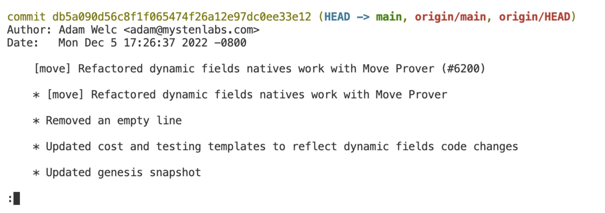
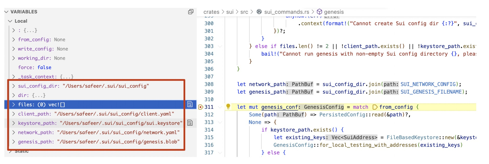
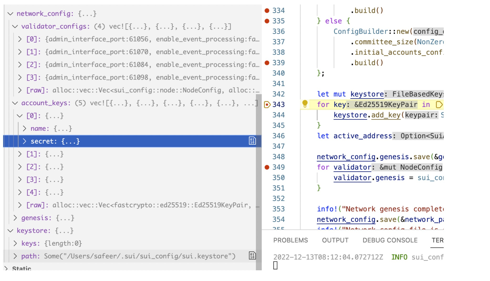
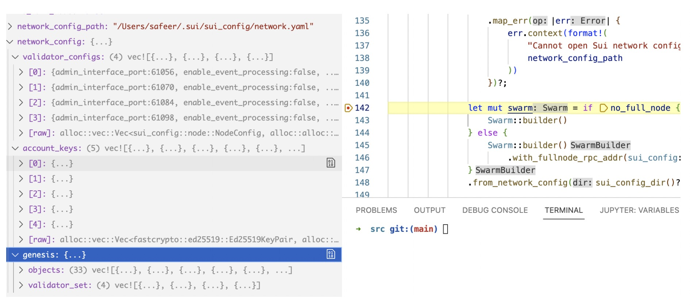
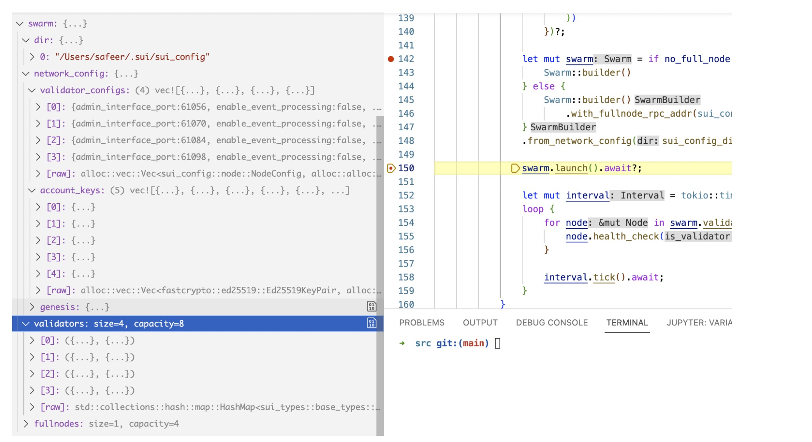
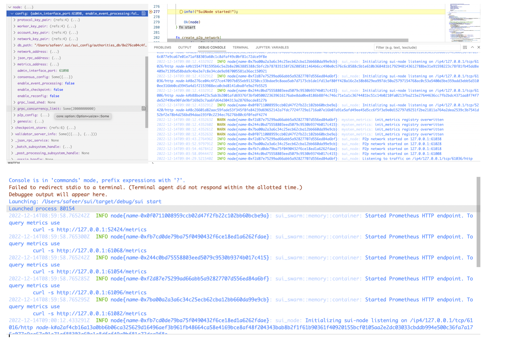

Since the code of sui is updated very quickly and we do not need to connect to devnet, so we select the main branch to analyze.

```bash
branch main
commit db5a090d56c8f1f065474f26a12e97dc0ee33e12
```


# Sui package

The Sui package is in `sui/crates/sui` folder. It will be compiled into the sui command line tool. The files structure of this package is as follows:

```bash
➜  sui git:(main) tree
.
├── Cargo.toml
├── build.rs
├── genesis.md
├── offline_signing.md
├── src
│   ├── client_commands.rs
│   ├── config
│   │   └── mod.rs
│   ├── console.rs
│   ├── genesis_ceremony.rs
│   ├── keytool.rs
│   ├── lib.rs
│   ├── main.rs
│   ├── shell.rs
│   ├── sui_commands.rs
│   ├── sui_move
│   │   ├── build.rs
│   │   ├── coverage.rs
│   │   ├── disassemble.rs
│   │   ├── mod.rs
│   │   ├── new.rs
│   │   ├── prove.rs
│   │   ├── sui-natives.bpl
│   │   └── unit_test.rs
│   └── unit_tests
│       ├── cli_tests.rs
│       ├── data
│       │   ├── dummy_modules_publish
│       │   │   ├── Move.toml
│       │   │   └── sources
│       │   │       └── trusted_coin.move
│       │   └── move_call_args_linter
│       │       ├── Move.toml
│       │       └── sources
│       │           └── object_basics.move
│       ├── keytool_tests.rs
│       └── shell_tests.rs
└── tests
    ├── full_node_tests.rs
    ├── move_test_code
    │   ├── Move.toml
    │   └── sources
    │       └── shared_objects_version.move
    ├── quorum_driver_tests.rs
    ├── readme.rs
    ├── reconfiguration_tests.rs
    ├── shared_objects_tests.rs
    ├── shared_objects_version_tests.rs
    ├── simulator_tests.rs
    └── transaction_orchestrator_tests.rs

12 directories, 38 files
```

# sui genesis

To create the configuration files and objects for a local Sui network, run the `genesis` command. 

Genesis creates the network configuration files in the ~/.sui/sui_config folder. This includes a YAML file for fullnode, network, client, and each validator. It also creates a sui.keystore that stores client key pairs.

Let's first look at how this command works.

> Entrance：`sui/crates/sui/src/main.rs —> fn main()`
> 

When we execute this command, we first parse the input parameters and then call `cmd.execute()`. This method will judge the input parameters and execute different codes for different commands.

```rust
//sui/crates/sui/src/main.rs
async fn main() {
    #[cfg(windows)]
    colored::control::set_virtual_terminal(true).unwrap();

    let bin_name = env!("CARGO_BIN_NAME");
    let cmd: SuiCommand = SuiCommand::parse();
    ...
    exit_main!(cmd.execute().await);
}
```

If we use `sui genesis`.The `execute()` will match `SuiCommand::Genesis` .And the will call `genesis()`.

```rust
//sui/crates/sui/src/sui_commands.rs
impl SuiCommand {
    pub async fn execute(self) -> Result<(), anyhow::Error> {
        match self {
            ...
            SuiCommand::Genesis {
                working_dir,
                force,
                from_config,
                write_config,
            } => genesis(from_config, write_config, working_dir, force).await,
		      ...   
			}
    }
}
```

This method mainly does 3 things:

1. read config from disk
2. create some objects with those config value
3. store important objects(Nodeconfig,genesis_conf & network_config) to disk

## Read config

If we do not provide the config dir,It will create it with default parameter. 

some default parameter:

```rust
//sui/crates/sui-config/src/ib.rs
const SUI_DIR: &str = ".sui";
const SUI_CONFIG_DIR: &str = "sui_config";
pub const SUI_NETWORK_CONFIG: &str = "network.yaml";
pub const SUI_FULLNODE_CONFIG: &str = "fullnode.yaml";
pub const SUI_CLIENT_CONFIG: &str = "client.yaml";
pub const SUI_KEYSTORE_FILENAME: &str = "sui.keystore";
pub const SUI_GATEWAY_CONFIG: &str = "gateway.yaml";
pub const SUI_GENESIS_FILENAME: &str = "genesis.blob";
pub const SUI_DEV_NET_URL: &str = "https://fullnode.devnet.sui.io:443";

pub const AUTHORITIES_DB_NAME: &str = "authorities_db";
pub const CONSENSUS_DB_NAME: &str = "consensus_db";
pub const FULL_NODE_DB_PATH: &str = "full_node_db";

const DEFAULT_STAKE: StakeUnit = 100000000000000;
const DEFAULT_GAS_PRICE: u64 = 1;
const DEFAULT_COMMISSION_RATE: u64 = 0;

//sui/crates/sui-config/src/genesis_config.rs
const DEFAULT_GAS_AMOUNT: u64 = 100000000000000;
const DEFAULT_NUMBER_OF_AUTHORITIES: usize = 4;
const DEFAULT_NUMBER_OF_ACCOUNT: usize = 5;
const DEFAULT_NUMBER_OF_OBJECT_PER_ACCOUNT: usize = 5;
```

```rust
//sui/crates/sui/src/sui-commands.rs
async fn genesis(
    from_config: Option<PathBuf>,
    write_config: Option<PathBuf>,
    working_dir: Option<PathBuf>,
    force: bool,
) -> Result<(), anyhow::Error> {
    let sui_config_dir = &match working_dir {
        // if a directory is specified, it must exist (it
        // will not be created)
        Some(v) => v,
        // create default Sui config dir if not specified
        // on the command line and if it does not exist
        // yet
        None => {
            let config_path = sui_config_dir()?;
            fs::create_dir_all(&config_path)?;
            config_path
        }
    };

     ...
		let client_path = sui_config_dir.join(SUI_CLIENT_CONFIG);
    let keystore_path = sui_config_dir.join(SUI_KEYSTORE_FILENAME);
    ...
		let network_path = sui_config_dir.join(SUI_NETWORK_CONFIG);
    let genesis_path = sui_config_dir.join(SUI_GENESIS_FILENAME);

    let mut genesis_conf = match from_config {
        Some(path) => PersistedConfig::read(&path)?,
        None => {
            if keystore_path.exists() {
                let existing_keys = FileBasedKeystore::new(&keystore_path)?.addresses();
                GenesisConfig::for_local_testing_with_addresses(existing_keys)
            } else {
                GenesisConfig::for_local_testing()
            }
        }
    };
...
```



## create objects

Generate some important objects according the given configuration files or default configuration parameters.

- network_config
- genesis_config
- Client_config

```rust
//sui/crates/sui/src/sui_commands.rs-->genesis()

let mut network_config = if let Some(validators) = validator_info {
        ConfigBuilder::new(sui_config_dir)
            .initial_accounts_config(genesis_conf)
            .with_validators(validators)
            .build()
    } else {
        ConfigBuilder::new(sui_config_dir)
            .committee_size(NonZeroUsize::new(genesis_conf.committee_size).unwrap())
            .initial_accounts_config(genesis_conf)
						//will finally call build_with-calidators() in sui-config/src/builder.rs
						//to genesis NetworkConfig{} and Nodeconfig
            .build()
    };

```



## store objects

After all objects are generated, the `network_config , genesis, validator,keystore and client_config`  will be written to disk.

```rust

    let mut keystore = FileBasedKeystore::new(&keystore_path)?;
    for key in &network_config.account_keys {
        keystore.add_key(SuiKeyPair::Ed25519SuiKeyPair(key.copy()))?;
    }
		//Take out the latest one in the keystore as active_address
    let active_address = keystore.addresses().pop();

    network_config.genesis.save(&genesis_path)?;
    for validator in &mut network_config.validator_configs {
        validator.genesis = sui_config::node::Genesis::new_from_file(&genesis_path);
    }

    info!("Network genesis completed.");
    network_config.save(&network_path)?;
    info!("Network config file is stored in {:?}.", network_path);

    info!("Client keystore is stored in {:?}.", keystore_path);

    let mut fullnode_config = network_config.generate_fullnode_config();
    fullnode_config.json_rpc_address = sui_config::node::default_json_rpc_address();
    fullnode_config.save(sui_config_dir.join(SUI_FULLNODE_CONFIG))?;

    for (i, validator) in network_config
        .into_validator_configs()
        .into_iter()
        .enumerate()
    {
        let path = sui_config_dir.join(format!("validator-config-{}.yaml", i));
        validator.save(path)?;
    }

    let mut client_config = if client_path.exists() {
        PersistedConfig::read(&client_path)?
    } else {
        SuiClientConfig::new(keystore.into())
    };
		...
    client_config.save(&client_path)?;
    info!("Client config file is stored in {:?}.", client_path);

    Ok(())
```

We can get the detail from the output log.

```rust
2022-12-13T08:12:04.072712Z  INFO sui_config::genesis_config: Creating accounts and gas objects...
2022-12-13T08:16:33.039813Z  INFO sui::sui_commands: Network genesis completed.
2022-12-13T08:16:33.069233Z  INFO sui::sui_commands: Network config file is stored in "/Users/safeer/.sui/sui_config/network.yaml".
2022-12-13T08:16:33.069286Z  INFO sui::sui_commands: Client keystore is stored in "/Users/safeer/.sui/sui_config/sui.keystore".
2022-12-13T08:18:02.582274Z  INFO sui::sui_commands: Client config file is stored in "/Users/safeer/.sui/sui_config/client.yaml"
```

```rust
➜  sui_config tree
.
├── client.yaml
├── fullnode.yaml
├── genesis.blob
├── network.yaml
├── sui.keystore
├── validator-config-0.yaml
├── validator-config-1.yaml
├── validator-config-2.yaml
└── validator-config-3.yaml
```


# sui start

Run `sui start` to start the local Sui network with default location for configuration.

This command looks for the Sui network configuration file `network.yaml` in the `~/.sui/sui_config` directory. If there is no configuration in this directory, it will call genesis() to genesis the default configuration first.

The sui node is divided into validator and full node:

- validator: validators to focus on servicing and processing transactions. When a validator commits a new set of transactions (or a block of transactions), the validator pushes that block to all connected Full nodes that then service the queries from clients.
- full node:Sui Full nodes validate blockchain activities, including transactions, checkpoints, and epoch changes. Each Full node stores and services the queries for the blockchain state and history.

It will do those things:

1. read configuration from disk(will call  genesis() to auto genesis if path is none)
2. build swarm with network_config(by default the swarm will contain 4 validators )
3. call swarm.launch() to start 4 validators.
4. run health Check service.

## read configuration

Before we used `sui genesis` to generate configuration files and perform storage persistence management.Here we will take it out, and then use these configuration files to generate `network_config` objects.

```rust
//sui/crates/sui/src/sui_commands.rs-->execute()
SuiCommand::Start {
                config,
                no_full_node,
            } => {
              ... 
							let network_config: NetworkConfig = PersistedConfig::read(&network_config_path)
                    .map_err(|err| {
                        err.context(format!(
                            "Cannot open Sui network config file at {:?}",
                            network_config_path
                        ))
                    })?;

//sui/crates/sui-config/src/lib.rs
fn load<P: AsRef<Path>>(path: P) -> Result<Self, anyhow::Error> {
        let path = path.as_ref();
        trace!("Reading config from {}", path.display());
        let reader = fs::File::open(path)
            .with_context(|| format!("Unable to load config from {}", path.display()))?;
        Ok(serde_yaml::from_reader(reader)?)
    }
```



## build swarm

Swarm is a handle to an in-memory Sui network.It contain a network_config and validators.

```rust
//sui/crates/sui-swarm/src/memory/swarm.rs
/// A handle to an in-memory Sui Network.
#[derive(Debug)]
pub struct Swarm {
    dir: SwarmDirectory,
    network_config: NetworkConfig,
    validators: HashMap<SuiAddress, Node>,
    fullnodes: HashMap<SuiAddress, Node>,
}
```

```rust
//sui/crates/sui/src/sui_commands.rs-->execute() 
let mut swarm = if no_full_node {
                    Swarm::builder()
                } else {
                    Swarm::builder()
                        .with_fullnode_rpc_addr(sui_config::node::default_json_rpc_address())
                }
                .from_network_config(sui_config_dir()?, network_config);
```



## run validators

After we build the swarm, we can use it to run each validator.

The whole process is:

`//node.spawn()-->Container::spawn()-->SuiNode::start()`

```rust
//sui/crates/sui/src/sui_commands.rs-->execute() 

swarm.launch().await?;

//sui/crates/sui-swarm/src/memory/swarm.rs
/// Start all of the Validators associated with this Swarm
    pub async fn launch(&mut self) -> Result<()> {
        let start_handles = self
            .nodes_iter_mut()
            .map(|node| node.spawn())
            .collect::<Result<Vec<_>>>()?;

        try_join_all(start_handles).await?;

        Ok(())
    }

////sui/crates/sui-swarm/src/memory/node.rs

/// Start this Node, returning a handle that will resolve when the node has completed starting
    /// up.
    pub fn spawn(&mut self) -> Result<tokio::sync::oneshot::Receiver<()>> {
        trace!(name =% self.name(), "starting in-memory node");
        let (startup_receiver, node_handle) =
            Container::spawn(self.config.clone(), self.runtime_type);
        self.thread = Some(node_handle);
        Ok(startup_receiver)
    }

////sui/crates/sui-swarm/src/memory/container.rs-->spawn()

runtime.block_on(async move {
                let prometheus_registry = metrics::start_prometheus_server(config.metrics_address);
                info!(
                    "Started Prometheus HTTP endpoint. To query metrics use\n\tcurl -s http://{}/metrics",
                    config.metrics_address
                );
                let _server = SuiNode::start(&config, prometheus_registry).await.unwrap();
                // Notify that we've successfully started the node
                let _ = startup_sender.send(());
                // run until canceled
                cancel_reciever.map(|_| ()).await;
```

### SuiNode

Suinode is the smallest unit of node management and is a very important object.It contains almost all the functions that a node needs to implement. The focus of our follow-up analysis is here.

The main members of it are:

- config
- checkpoint_store
- _batch_subsystem_handle
- _execute_driver_handle
- state
- active
- _p2p_network
- _discovery
- _state_sync
- sim_node

```rust

//sui/crates/sui-node/src/lib.rs

pub struct SuiNode {
    config: NodeConfig,
    checkpoint_store: Arc<CheckpointStore>,
    validator_server_info: Option<ValidatorServerInfo>,
    _json_rpc_service: Option<ServerHandle>,
    _batch_subsystem_handle: tokio::task::JoinHandle<()>,
    _post_processing_subsystem_handle: Option<tokio::task::JoinHandle<Result<()>>>,
    _gossip_handle: Option<tokio::task::JoinHandle<()>>,
    _execute_driver_handle: tokio::task::JoinHandle<()>,
    state: Arc<AuthorityState>,
    active: Arc<ActiveAuthority<NetworkAuthorityClient>>,
    transaction_orchestrator: Option<Arc<TransactiondOrchestrator<NetworkAuthorityClient>>>,
    _prometheus_registry: Registry,

    _p2p_network: anemo::Network,
    _discovery: discovery::Handle,
    _state_sync: state_sync::Handle,

    reconfig_channel: (
        tokio::sync::mpsc::Sender<EpochId>,
        tokio::sync::mpsc::Receiver<EpochId>,
    ),

    #[cfg(msim)]
    sim_node: sui_simulator::runtime::NodeHandle,
}

```

Now let's analyze the detailed steps in the node startup process:

1. Judging whether it is fullnode or validator
2. Initialize DB(committee_store,checkpoint_store,state_sync_store,index_store,event_store)
3. create p2p network(discovery_handle,state_sync_handle)
4. create transaction_streamer (if it’s fullNode)
5. create node_sync_store
6. create handles(batch_subsystem_handle,post_processing_subsystem_handle,execute_driver_handle)
7. create json_rpc_service
8. finish start up

```rust

//sui/crates/sui-node/src/lib.rs
pub async fn start(config: &NodeConfig, prometheus_registry: Registry) -> Result<SuiNode> {
        ...
        let store =
            Arc::new(AuthorityStore::open(&config.db_path().join("store"), None, genesis).await?);
        let committee_store = Arc::new(CommitteeStore::new(
            config.db_path().join("epochs"),
            &committee,
            None,
        ));
        let checkpoint_store = CheckpointStore::new(&config.db_path().join("checkpoints"));

        let state_sync_store = RocksDbStore::new(
            store.clone(),
            committee_store.clone(),
            checkpoint_store.clone(),
        );

        let index_store = if is_validator {
            None
        } else {
            Some(Arc::new(IndexStore::open_tables_read_write(
                config.db_path().join("indexes"),
                None,
                None,
            )))
        };

        let event_store = if config.enable_event_processing {
            let path = config.db_path().join("events.db");
            let db = SqlEventStore::new_from_file(&path).await?;
            db.initialize().await?;
            Some(Arc::new(EventStoreType::SqlEventStore(db)))
        } else {
            None
        };

        let (p2p_network, discovery_handle, state_sync_handle) =
            Self::create_p2p_network(config, state_sync_store, &prometheus_registry)?;

       ...
        let node_sync_store = Arc::new(NodeSyncStore::open_tables_read_write(
            config.db_path().join("node_sync_db"),
            None,
            None,
        ));

        ...

        let batch_subsystem_handle = {
            // Start batch system so that this node can be followed
            let batch_state = state.clone();
            spawn_monitored_task!(async move {
                batch_state
                    .run_batch_service(1000, Duration::from_secs(1))
                    .await
            })
        };

        let post_processing_subsystem_handle =
            if index_store.is_some() || config.enable_event_processing {
                let indexing_state = state.clone();
                Some(spawn_monitored_task!(async move {
                    indexing_state
                        .run_tx_post_processing_process()
                        .await
                        .map_err(Into::into)
                }))
            } else {
                None
            };

        
        let execute_driver_handle = active_authority.clone().spawn_execute_process().await;
				...
        let json_rpc_service = build_server(
            state.clone(),
            &transaction_orchestrator.clone(),
            config,
            &prometheus_registry,
        )
        .await?;

			 ...

        info!("SuiNode started!");

        Ok(node)
```



We can get more info from the debug output.(here we only focus on the startup information of one node: 0x0f0711008959ccb02d47f2fb22c102bb60bcbe9a).

```bash
Launching: /Users/safeer/sui/target/debug/sui start
Launched process 80154
2022-12-14T08:59:58.765242Z  INFO node{name=0x0f0711008959ccb02d47f2fb22c102bb60bcbe9a}: sui_swarm::memory::container: Started Prometheus HTTP endpoint. To query metrics use
	curl -s http://127.0.0.1:52424/metrics
2022-12-14T08:59:58.765242Z  INFO node{name=0x0f0711008959ccb02d47f2fb22c102bb60bcbe9a}: sui_swarm::memory::container: Started Prometheus HTTP endpoint. To query metrics use
2022-12-14T09:00:12.433291Z  INFO node{name=0x0f0711008959ccb02d47f2fb22c102bb60bcbe9a}: sui_node: Initializing sui-node listening on /ip4/127.0.0.1/tcp/52420/http node=k#8c26601d82aac59fade53f345f8fe84239d69652142a7fdc7724f729a1716a07e16b07a91e5afd49ee45d5cc6f5f3a9e0d152797d9251f2be21811a764a2dea2539c3b7541d52bf2e78b4d256bd94daa193f0c2234ec76276b80c6f0fedf4274
2022-12-14T09:00:12.435263Z  WARN node{name=0x0f0711008959ccb02d47f2fb22c102bb60bcbe9a}: mysten_metrics: init_metrics registry overwritten
2022-12-14T09:13:51.573049Z  INFO node{name=0x0f0711008959ccb02d47f2fb22c102bb60bcbe9a}: sui_storage::event_store::sql: Created/opened SQLite EventStore on disk db_path="/Users/safeer/.sui/sui_config/authorities_db/2727618050/events.db"
2022-12-14T09:13:56.940186Z  INFO node{name=0x0f0711008959ccb02d47f2fb22c102bb60bcbe9a}: sui_storage::event_store::sql: SQLite events table is initialized with query "CREATE TABLE IF NOT EXISTS events(timestamp INTEGER NOT NULL, seq_num INTEGER, event_num INTEGER, tx_digest BLOB, event_type INTEGER, package_id BLOB, module_name TEXT, function TEXT, object_type TEXT, object_id BLOB, fields TEXT, move_event_name TEXT, contents BLOB, sender BLOB, recipient TEXT);"
2022-12-14T09:14:05.392089Z  INFO node{name=0x0f0711008959ccb02d47f2fb22c102bb60bcbe9a}: sui_storage::event_store::sql: Index is ready column="seq_num"
2022-12-14T09:14:10.311911Z  INFO node{name=0x0f0711008959ccb02d47f2fb22c102bb60bcbe9a}: sui_storage::event_store::sql: Index is ready column="event_num"
2022-12-14T09:14:13.542209Z  INFO node{name=0x0f0711008959ccb02d47f2fb22c102bb60bcbe9a}: sui_storage::event_store::sql: Index is ready column="timestamp"
2022-12-14T09:14:17.262100Z  INFO node{name=0x0f0711008959ccb02d47f2fb22c102bb60bcbe9a}: sui_storage::event_store::sql: Index is ready column="tx_digest"
2022-12-14T09:14:20.959975Z  INFO node{name=0x0f0711008959ccb02d47f2fb22c102bb60bcbe9a}: sui_storage::event_store::sql: Index is ready column="event_type"
2022-12-14T09:14:26.008174Z  INFO node{name=0x0f0711008959ccb02d47f2fb22c102bb60bcbe9a}: sui_storage::event_store::sql: Index is ready column="package_id"
2022-12-14T09:14:30.079815Z  INFO node{name=0x0f0711008959ccb02d47f2fb22c102bb60bcbe9a}: sui_storage::event_store::sql: Index is ready column="module_name"
2022-12-14T09:14:36.559934Z  INFO node{name=0x0f0711008959ccb02d47f2fb22c102bb60bcbe9a}: sui_storage::event_store::sql: Index is ready column="sender"
2022-12-14T09:14:36.567273Z  INFO node{name=0x0f0711008959ccb02d47f2fb22c102bb60bcbe9a}: sui_storage::event_store::sql: Index is ready column="recipient"
2022-12-14T09:14:36.574490Z  INFO node{name=0x0f0711008959ccb02d47f2fb22c102bb60bcbe9a}: sui_storage::event_store::sql: Index is ready column="object_id"
2022-12-14T09:14:36.582455Z  INFO node{name=0x0f0711008959ccb02d47f2fb22c102bb60bcbe9a}: sui_storage::event_store::sql: Index is ready column="object_type"
2022-12-14T09:14:36.589734Z  INFO node{name=0x0f0711008959ccb02d47f2fb22c102bb60bcbe9a}: sui_storage::event_store::sql: Index is ready column="move_event_name"
2022-12-14T09:14:36.598456Z  INFO node{name=0x0f0711008959ccb02d47f2fb22c102bb60bcbe9a}: sui_node: P2p network started on 127.0.0.1:52422
2022-12-14T09:14:43.930692Z  INFO node{name=0x0f0711008959ccb02d47f2fb22c102bb60bcbe9a}: sui_core::authority_active: respawn_node_sync_process epoch=0
2022-12-14T09:14:43.931350Z  INFO node{name=0x0f0711008959ccb02d47f2fb22c102bb60bcbe9a}: sui_core::authority_active: spawning node sync task
2022-12-14T09:14:46.921729Z  INFO node{name=0x0f0711008959ccb02d47f2fb22c102bb60bcbe9a}: sui_json_rpc: acl=Const("*")
2022-12-14T09:14:46.922716Z  INFO node{name=0x0f0711008959ccb02d47f2fb22c102bb60bcbe9a}: sui_json_rpc: Sui JSON-RPC server listening on 0.0.0.0:9000 local_addr=0.0.0.0:9000
2022-12-14T09:14:46.922772Z  INFO node{name=0x0f0711008959ccb02d47f2fb22c102bb60bcbe9a}: sui_json_rpc: Available JSON-RPC methods : ["sui_moveCall", "sui_getCoinMetadata", "sui_publish", "sui_getObjectsOwnedByAddress", "sui_payAllSui", "sui_transferObject", "sui_unsubscribeEvent", "sui_executeTransaction", "sui_mergeCoins", "sui_subscribeTransaction", "sui_getEvents", "sui_getObject", "sui_getTransactionsInRange", "sui_getObjectsOwnedByObject", "sui_executeTransactionSerializedSig", "sui_subscribeEvent", "sui_paySui", "sui_getRawObject", "sui_splitCoin", "sui_getNormalizedMoveFunction", "sui_getTransaction", "sui_getTotalTransactionNumber", "sui_pay", "sui_getTransactionAuthSigners", "sui_getMoveFunctionArgTypes", "sui_transferSui", "sui_batchTransaction", "sui_unsubscribeTransaction", "sui_dryRunTransaction", "sui_splitCoinEqual", "sui_getNormalizedMoveModule", "sui_getNormalizedMoveModulesByPackage", "sui_tryGetPastObject", "rpc.discover", "sui_getTransactions", "sui_getCommitteeInfo", "sui_getNormalizedMoveStruct"]
2022-12-14T09:14:58.627411Z  INFO node{name=0x0f0711008959ccb02d47f2fb22c102bb60bcbe9a}: sui_node: SuiNode started!
2022-12-14T09:15:08.957227Z  INFO node{name=0x0f0711008959ccb02d47f2fb22c102bb60bcbe9a}:connection-manager{peer=82a014fa}: anemo::network::connection_manager: ConnectionManager started
2022-12-14T09:15:08.957369Z  INFO node{name=0x0f0711008959ccb02d47f2fb22c102bb60bcbe9a}: sui_network::discovery: Discovery started
2022-12-14T09:15:08.957515Z  INFO node{name=0x0f0711008959ccb02d47f2fb22c102bb60bcbe9a}: sui_network::state_sync: State-Synchronizer started
2022-12-14T09:15:08.960911Z  INFO node{name=0x0f0711008959ccb02d47f2fb22c102bb60bcbe9a}: sui_core::authority_active::execution_driver: Starting pending certificates execution process.
```

## health check

After starting the nodes,Performing a health check service to check that status of the node(Check every 5 seconds).

```rust

////sui/crates/sui-swarm/src/memory/node.rs-->spawn()

/// Perform a health check on this Node by:
    /// * Checking that the node is running
    /// * Calling the Node's gRPC Health service if it's a validator.
    pub async fn health_check(&self, is_validator: bool) -> Result<(), HealthCheckError> {
        let thread = self.thread.as_ref().ok_or(HealthCheckError::NotRunning)?;
        if !thread.is_alive() {
            return Err(HealthCheckError::NotRunning);
        }

        if is_validator {
            let channel = mysten_network::client::connect(self.config.network_address())
                .await
                .map_err(|err| anyhow!(err.to_string()))
                .map_err(HealthCheckError::Failure)
                .tap_err(|e| error!("error connecting to {}: {e}", self.name()))?;

            let mut client = tonic_health::proto::health_client::HealthClient::new(channel);
            client
                .check(tonic_health::proto::HealthCheckRequest::default())
                .await
                .map_err(|e| HealthCheckError::Failure(e.into()))
                .tap_err(|e| error!("error performing health check on {}: {e}", self.name()))?;
        }

        Ok(())
    }
```

# **Summarize**
We analyzed the startup process of the node in this page. 

- reading the configuration file
- generating objects according to the configuration file
- open services during the node startup process

In the following articles, we will analyze each part in detail, the most important of which is to analyze the various services opened during the node startup process(SuiNode object).