We can learn Sui concepts from here:
[https://docs.sui.io/learn/how-sui-works](https://docs.sui.io/learn/how-sui-works)

# SUI CODE ARCHITECTURE
The latest version of the code  is `devnet-0.17.0`

```jsx
git clone https://github.com/MystenLabs/sui.git
```

```bash
.
├── CODE_OF_CONDUCT.MD
├── CONTRIBUTING.md
├── Cargo.lock
├── Cargo.toml
├── DEVX_ROADMAP.md
├── ISSUES.md
├── LICENSE
├── LICENSE-docs
├── README.md
├── RELEASES.md
├── SECURITY.md
├── apps
│   ├── core
│   ├── explorer
│   └── wallet
├── crates
│   ├── component
│   ├── mysten-metrics
│   ├── mysten-network
│   ├── mysten-util-mem
│   ├── mysten-util-mem-derive
│   ├── prometheus-closure-metric
│   ├── rccheck
│   ├── sui
│   ├── sui-adapter
│   ├── sui-adapter-transactional-tests
│   ├── sui-benchmark
│   ├── sui-cluster-test
│   ├── sui-config
│   ├── sui-core
│   ├── sui-cost
│   ├── sui-cost-tables
│   ├── sui-faucet
│   ├── sui-framework
│   ├── sui-framework-build
│   ├── sui-indexer
│   ├── sui-json
│   ├── sui-json-rpc
│   ├── sui-json-rpc-types
│   ├── sui-keys
│   ├── sui-macros
│   ├── sui-network
│   ├── sui-node
│   ├── sui-open-rpc
│   ├── sui-open-rpc-macros
│   ├── sui-rosetta
│   ├── sui-sdk
│   ├── sui-simulator
│   ├── sui-source-validation
│   ├── sui-storage
│   ├── sui-swarm
│   ├── sui-telemetry
│   ├── sui-test-validator
│   ├── sui-tool
│   ├── sui-transaction-builder
│   ├── sui-transactional-test-runner
│   ├── sui-types
│   ├── sui-verifier
│   ├── sui-verifier-transactional-tests
│   ├── telemetry-subscribers
│   ├── test-utils
│   ├── typed-store
│   ├── typed-store-derive
│   ├── workspace-hack
│   └── x
├── dapps
│   └── README.md
├── deny.toml
├── doc
│   ├── book
│   ├── code-examples
│   ├── locals
│   ├── paper
│   ├── src
│   ├── static
│   ├── template
│   ├── tips
│   └── utils
├── docker
│   ├── fullnode
│   ├── sui-node
│   └── sui-tools
├── narwhal
│   ├── CONTRIBUTING.md
│   ├── Docker
│   ├── README.md
│   ├── benchmark
│   ├── config
│   ├── consensus
│   ├── crypto
│   ├── dag
│   ├── deny.toml
│   ├── examples
│   ├── executor
│   ├── network
│   ├── node
│   ├── primary
│   ├── scripts
│   ├── storage
│   ├── test-utils
│   ├── types
│   └── worker
├── package.json
├── pnpm-lock.yaml
├── pnpm-workspace.yaml
├── rust-toolchain
├── rustfmt.toml
├── scripts
│   ├── bench_sweep.py
│   ├── changed-files.sh
│   ├── dependency.py
│   ├── simtest
│   ├── update_fastcrypto.sh
│   └── update_narwhal.sh
├── sdk
│   ├── bcs
│   ├── typescript
│   └── wallet-adapter
├── sui_programmability
│   └── examples
└── target
    ├── CACHEDIR.TAG
    ├── debug
    └── tmp
```

As we can see, the structure of the code is similar to Aptos.

Different functions are organized in different packages in `sui/crates/ folder`.The most parts are those:

```bash
├── crates
│   ├── sui
│   ├── sui-config
│   ├── sui-core
│   ├── sui-faucet
│   ├── sui-keys
│   ├── sui-macros
│   ├── sui-network
│   ├── sui-node
```

## cartes/sui

Like Aptos, the Sui is a CLI tool. we can use it to create a testnet node or interact with sui network. The endpoint of code is in `crates/src/main.rc —> fn main()`. Our entire code analysis process starts with this entry.

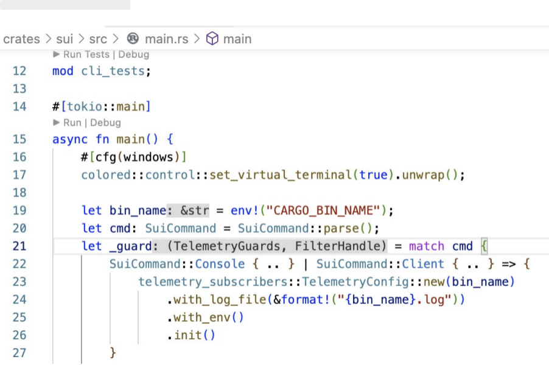

## other packages

- sui-faucet - sui faucet related service.
- sui-node - node related
- sui-core - authority server and Sui Gateway
- sui-types - coins, gas, and other object types
- sui-network - networking interfaces


# Build Sui and run local testnet

The Sui repository includes two primary branches, `devnet` and `main`.

- The `devnet` branch includes the latest stable build of Sui. Choose the `devnet` branch if you want to build or test on Sui. If you encounter an issue or find a bug, it may already be fixed in the `main` branch. To submit a pull request (PR), you should push commits to your fork of the `main` branch.
- The `main` branch includes the most recent changes and updates. Use the `main` branch if you want to contribute to the Sui project. The `main` branch may include unreleased changes, or introduce changes that cause issues in apps created using an earlier version.

> *The previous* `git clone` *command syncs with the* `devnet` *branch, which makes sure the source code is compatible with our Devnet. If you want to run a network locally using the latest version and don't need to interact with our Devnet, you should switch to* `main` *branch.*
> 

## **Build**

Cause the development team did not provide a compiled version,so we have to build Sui by ourself. We can use this command to build.

```bash
cargo install --locked --git https://github.com/MystenLabs/sui.git --branch devnet sui
```

This will take a long time and may fail with an error.If there is any error causing the failure.That is probably due to environmental problems(the version of the compilation tool is too low).Please update all the tools required and retry.If you still can't compile, then change the system.

I have been unable to compile successfully using macos 10.14.1 before, and I successed after I changed it to 12.6.

It took about an hour to compile this.

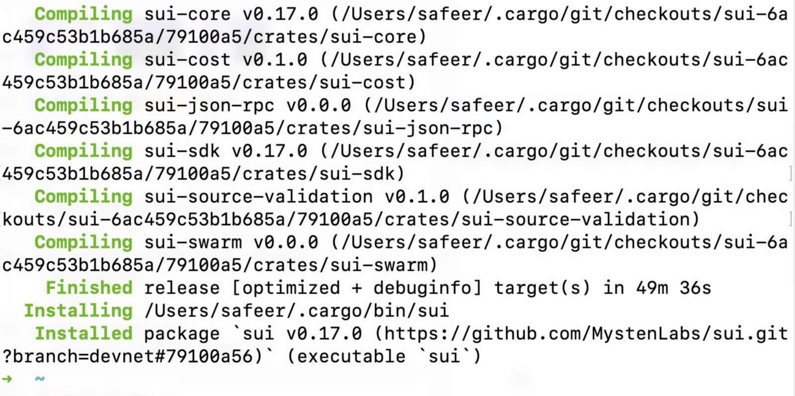

> For more detail : [https://docs.sui.io/build/install](https://docs.sui.io/build/install)
> 

After we compiled we can see the executable file in `~/.carge/bin/sui`. And the we can use it to run local testnet.

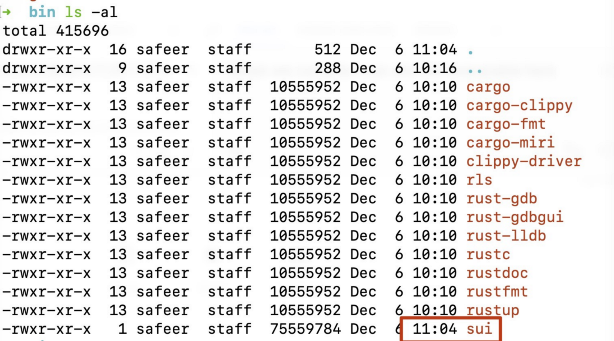

## genesis

To create the configuration files and objects for a local Sui network, run the `genesis` command. Genesis creates the network configuration files in the `~/.sui/sui_config` folder. 

```bash
#genesis 
sui genesis

#output
2022-12-06T08:54:58.103638Z  INFO sui_config::genesis_config: Creating accounts and gas objects...
2022-12-06T08:54:58.190260Z  INFO sui::sui_commands: Network genesis completed.
2022-12-06T08:54:58.193319Z  INFO sui::sui_commands: Network config file is stored in "/Users/safeer/.sui/sui_config/network.yaml".
2022-12-06T08:54:58.193344Z  INFO sui::sui_commands: Client keystore is stored in "/Users/safeer/.sui/sui_config/sui.keystore".
2022-12-06T08:54:58.198162Z  INFO sui::sui_commands: Client config file is stored in "/Users/safeer/.sui/sui_config/client.yaml".
```

This includes a YAML file for fullnode, network, client, and each validator. It also creates a sui.keystore that stores client key pairs.

The network that genesis creates includes four validators and five user accounts that contain five coin objects each.

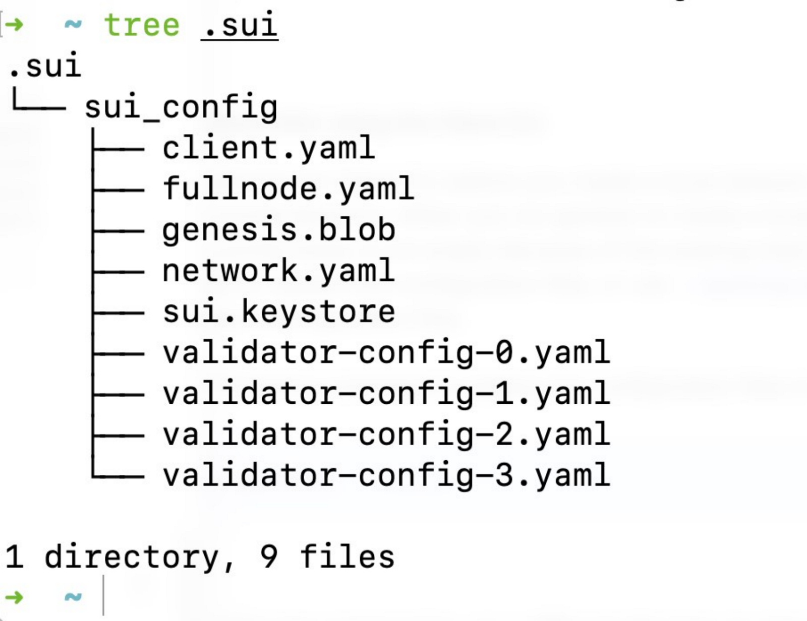

## Start the local network

Run the following command to start the local Sui network with default configuration( `~/.sui/sui_config/network.yaml`).

```bash
sui start
```

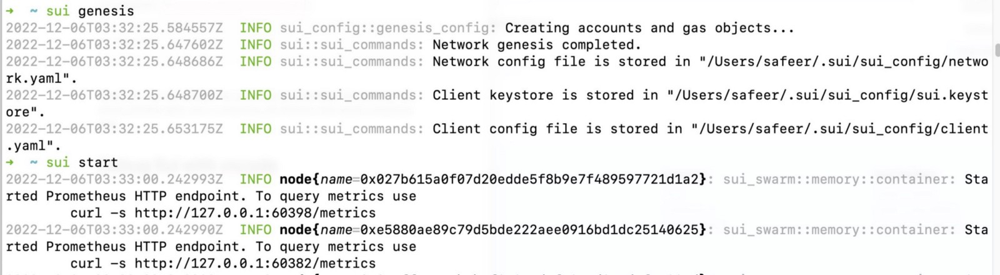

When you start the network, Sui generates an `authorities_db directory` that stores validator data, and a `consensus_db` directory that stores consensus data.

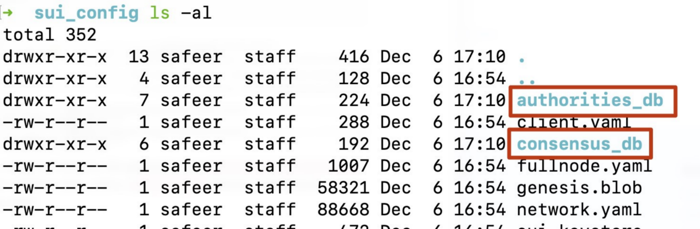

# Interact with Sui local network

## sui client

we can use Sui CLI to interact with Sui net

```bash
#use -h to show help of sui cli
sui -h   

# use subcommand help
sui client -h

# use interactive shell
#The console command looks for the client configuration file client.yaml in the ~/.sui/sui_config directory
sui console 
```

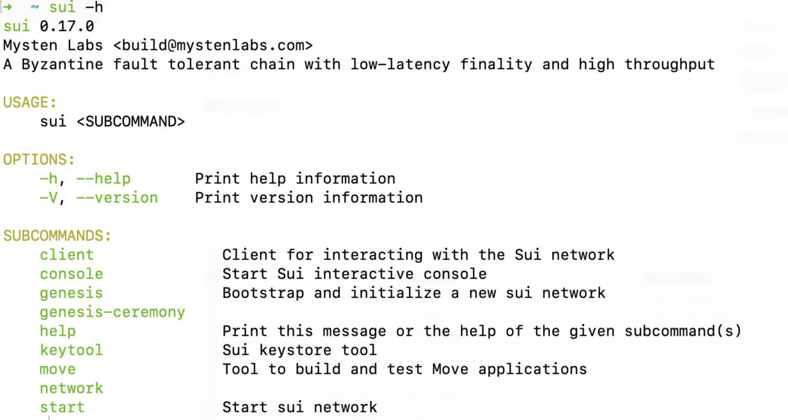

Some example:

```bash
#the list of account addresses available on the platform
sui client addresses

#Sui sets a default address to use for commands. It uses the active address for commands that require an address.
sui client active-address

#You can call the objects command with or without specifying an address. Sui uses the active address if you do not specify one.
sui client objects

#create a new address
sui client new-address ed25519

# send a trabsfer
sui client transfer --to 0x49450a4a3cac01a44be9e82fe1b29df5a24bd244 --object-id 0xcc054f9b68501541c4a5355920fb896b1765a889 --gas-budget 100
```

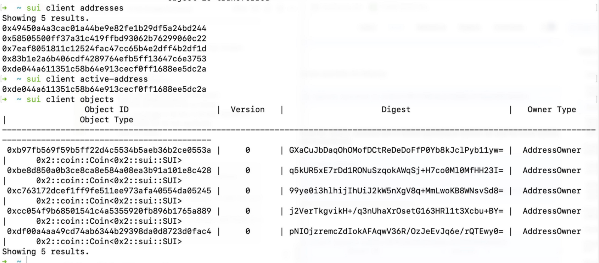

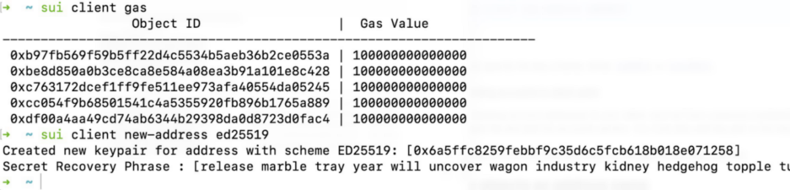

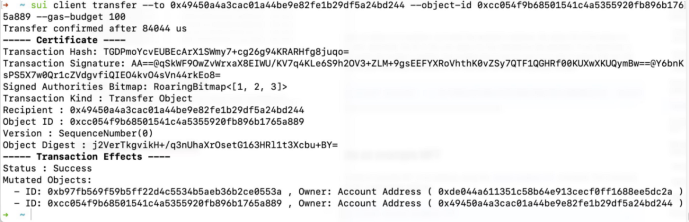

# Debug Sui with vscode

In the process of analyzing code, debugging is an essential step.It can help us understand the logic and flow during code execution. It can also help us find bugs in the code.

Steps(on mac):

1. install vscode and plug-in (rust-analyzer,CodeLLDB)
2. open the sui folder
3. open the target file

create new launch.json file(will be automatically generated  ).

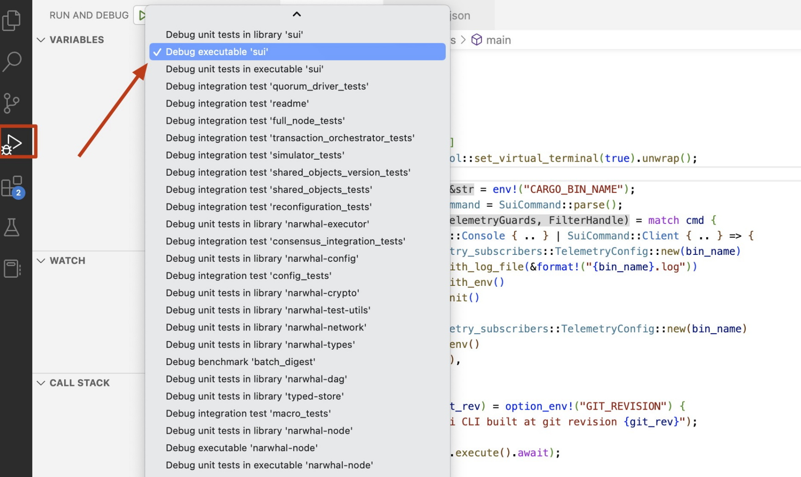

add args:

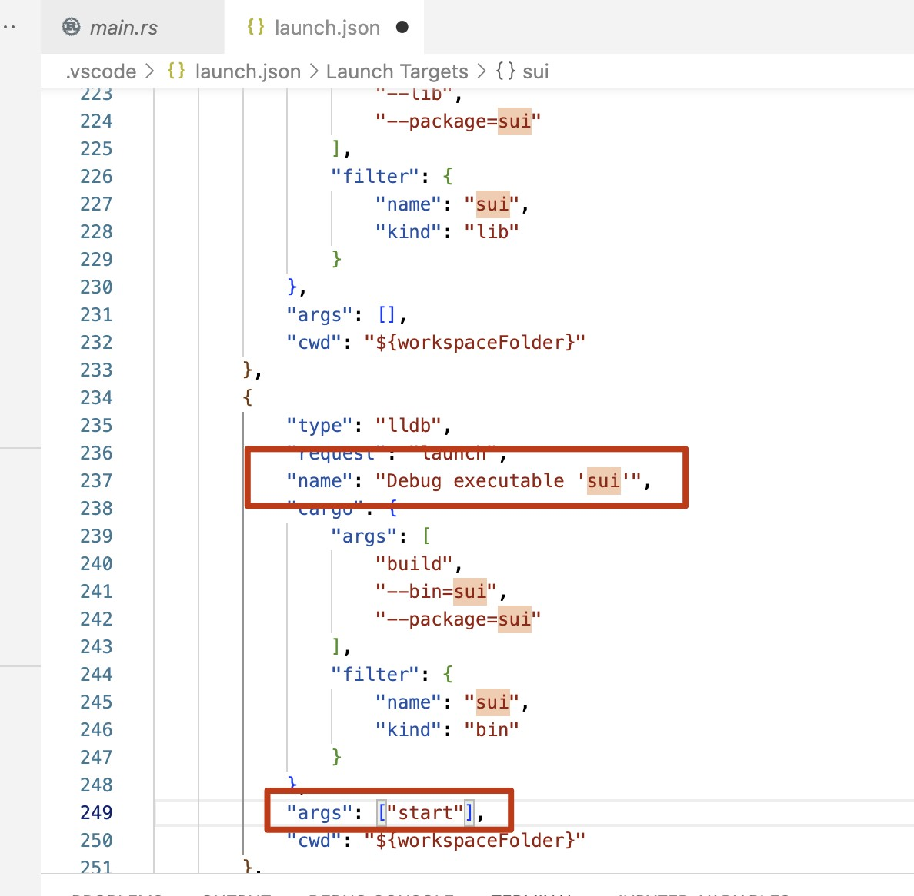

Start to debug:

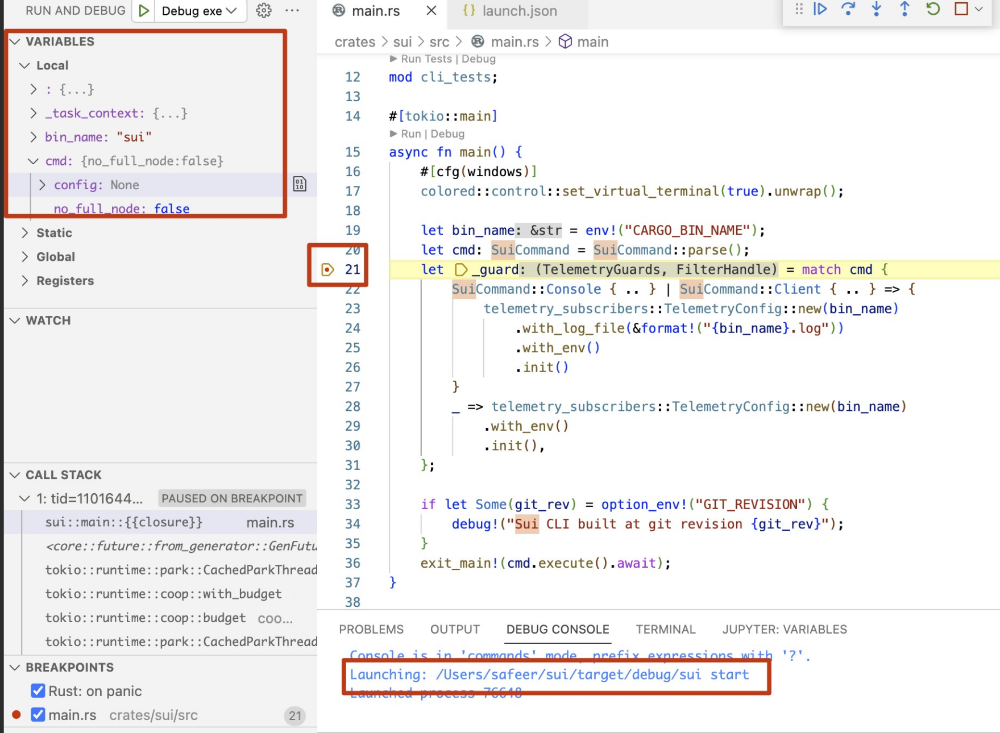

**About MoveBit**

**MoveBit is a blockchain security company focused on the Move Ecosystem by pioneering the use of cutting-edge Formal Verification. The team consists of security professionals from academia and enterprise with 10 years of security experience. they were one of the earliest contributors to the Move ecosystem, working with Move developers to set the standard for secure Move applications and make the Move ecosystem the most secure Web3 destination.**

Twitter: https://twitter.com/MoveBit_  
Medium: https://movebit.medium.com/
Github: https://github.com/movebit
Discord: https://discord.com/invite/7wM8VU9Gyj
