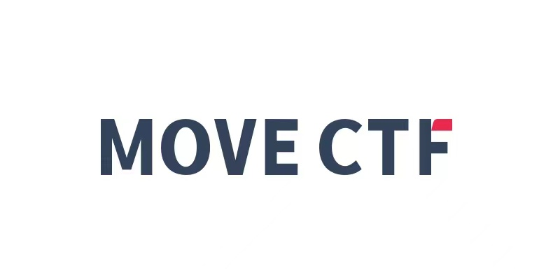

The Move ecosystem is booming, and with it comes a need for Move-specific security expertise. Though Move is a secure and safe language by design, Move developers still need a place to learn and practice writing secure Move smart contracts.
 
The Move community is thus organizing a flagship Move security competition to attract more security professionals and developers interested in the Move language and the Move ecosystem. 
 
MoveBit is collaborating with many Move ecosystem projects to organize the first ever Move ecosystem CTF (Capture The Flag) security competition: MoveCTF. Mysten Labs (Sui) will be a supporter and sole sponsor of the competition.

 
MoveCTF's first Move security competition will be held online. The competition will take place from 6pm on November 5 to 6pm on November 7 (PST), for a total of 48 hours. This MoveCTF competition will set four security challenges related to Move language, with a range of difficulty levels. Participants will earn points for completing each challenge. The top four fastest participants for each challenge will be rewarded with additional points.
 
The top three winners ranked by total points will be awarded 1000 USD, 500 USD, and 300 USD respectively, sponsored by Mysten Labs (Sui). In addition, MoveCTF partner Mynft will mint a mystery NFT for each of the three winners on Suia. Mynft will also mint a Move Hacker NFT for each participant who completes at least one Move security challenge.
 
Registration for the MoveCTF competition is now open. For more information, please visit this link:  https://movectf.movebit.xyz/
 
## About MoveBit
MoveBit is a security audit company for the Move ecosystem with a vision to make Move’s ecosystem the most secure Web3 destination. The MoveBit team is composed of academic security experts and corporate security leaders with 10 years of security experience. The team was one of the earliest contributors to the Move ecosystem, and works with Move developers to formulate the standards for secure Move applications.

## About Mysten Labs
 
Mysten Labs develops tools that make Web3 secure, reliable, and ready for mass adoption. It creates foundational infrastructure to accelerate the adoption of Web3. The company gathers the brightest minds to create infrastructure and tools for a decentralized future for everyone.

Sui by Mysten Labs is a next-generation smart contract platform with high throughput and low latency, an asset-oriented programming model powered by Move. It is designed from the ground up to enable creators and developers to build Web3 applications that could cater to billions of users.

