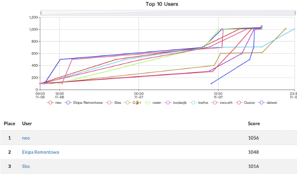
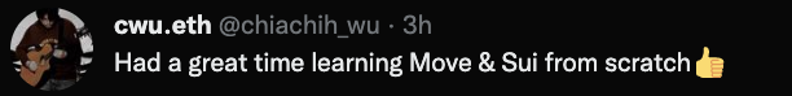
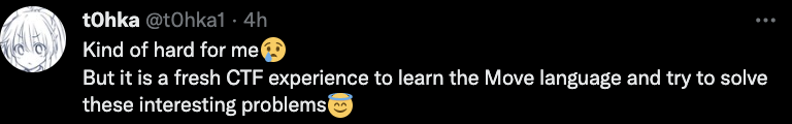

MoveCTF  (Nov 5 — Nov 7 / 2022), the first Move CTF (Capture The Flag) security competition, exclusively sponsored by Sui Network development company Mysten Labs, concluded successfully. The competition was organized by MoveBit, ChainFlag, OtterSec and co-organized by Mynft and SuiWorld DAO.

By the end of the competition (November 7, 2022 at 6:00 PST), there were 1,280 registered competitors from 25 countries and regions worldwide. The competition had four challenges: checkin, simple game, flash loan, and move lock. A total of 18 people solved all four challenges.

Each challenge was completed as follows.
* checkin 305 solves 
* simple game 22 solves
* move lock 37 solves
* flash loan 41 solves

The top three winners were neo, Ekipa Remontowa, and Slss. Congrats to these three winners, who will receive an exclusive prize sponsored by Sui Network and a special NFT. The remaining participants who completed at least one challenge will receive a Sui net-based POAP NFT.

In addition, the MoveCTF was well received by Move language learners, and we will soon open four challenges for the Move community to learn and use.

Thanks to all the participants and partners, let's look forward to the next Move CTF!

MoveCTF official website: 
[http://movectf.movebit.xyz/](http://movectf.movebit.xyz/)

MoveBit official website: 
[https://www.movebit.xyz/](https://www.movebit.xyz/)
